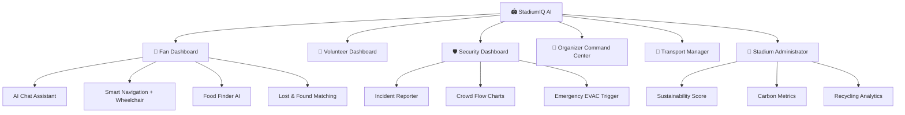

<div align="center">

# 🏟️ StadiumIQ AI

### *FIFA World Cup 2026 — Smart Stadium & Operations Platform*

<br/>

[](https://nextjs.org/)
[](https://www.typescriptlang.org/)
[](https://www.python.org/)
[](https://fastapi.tiangolo.com/)
[](https://aistudio.google.com/)
[](https://firebase.google.com/)

<br/>

[](LICENSE)
[](/)
[](/)
[](https://vercel.com/)
[](https://render.com/)
[](/)

<br/>

> **StadiumIQ AI** is a production-ready, GenAI-powered smart stadium operations platform for the **FIFA World Cup 2026**. It provides role-based dashboards for fans, volunteers, security, organizers, transport managers, and stadium administrators — all powered by Google Gemini AI with a comprehensive offline simulation fallback.

</div>

---

## 📸 Overview

| Role | Features |
|------|----------|
| 🙋 **Fan** | Smart navigation, match commentary, food finder, lost & found AI |
| 🦺 **Volunteer** | Incident logger, multi-language translation assistant, shift info |
| 🛡️ **Security Staff** | Structured incident reports, crowd flow trend charts |
| 🎯 **Organizer** | Real-time attendance logs, AI-generated morning briefings |
| 🚌 **Transport Manager** | Metro/shuttle ETAs, transit distribution analytics |
| 🏢 **Stadium Admin** | Sustainability score, carbon footprint & recycling metrics |

---

## ✨ Key Features

<table>
<tr>
<td width="50%">

### 🤖 AI-Powered
- **Gemini 1.5 Flash** integration for all intelligent features
- AI Chat Assistant for fan queries (gate directions, food, facilities)
- Auto-generated daily operations briefing for organizers
- AI incident report summarization for security staff
- Smart sustainability suggestions for administrators
- **Full offline simulation fallback** — works without any API key

</td>
<td width="50%">

### 🗺️ Navigation & Safety
- Smart indoor navigation (Gate → Seat routing)
- ♿ Wheelchair-accessible route planning
- 🚨 Emergency evacuation mode with voice alerts
- Animated route visualization with ETA estimates
- Real-time crowd flow heatmaps
- Push notification system for stadium alerts

</td>
</tr>
<tr>
<td width="50%">

### 🎨 Premium UI/UX
- **Glassmorphic** dark-mode interface with glowing borders
- Animated background mesh with ambient light effects
- Smooth micro-interactions and hover scale transitions
- ♿ High-contrast accessibility mode
- 🔊 Text-to-Speech (TTS) & Speech-to-Text (STT) support
- Fully responsive across all screen sizes

</td>
<td width="50%">

### 📊 Data & Analytics
- Live attendance tracking with area charts (Recharts)
- Crowd density trend lines for security monitoring
- Transport share distribution via pie charts
- Sustainability KPIs: carbon score, recycling rate, energy index
- Multi-language support (EN, ES, FR, AR, PT, DE, ZH, HI)
- Lost & Found AI matching system

</td>
</tr>
</table>

---

## 💻 Tech Stack

### Frontend
| Technology | Version | Purpose |
|---|---|---|
|  | v15 (App Router) | Core React framework |
|  | v5 | Type-safe development |
|  | v4 | Utility-first styling |
|  | v2 | Data visualization charts |
|  | Latest | Icon library |

### Backend
| Technology | Version | Purpose |
|---|---|---|
|  | v3.9+ | Runtime |
|  | v0.100+ | REST API framework |
|  | Latest | ASGI server |
|  | v2 | Data validation |

### Cloud & AI Services
| Service | Plan | Purpose |
|---|---|---|
|  | Free Tier | AI chat, briefings, reports |
|  | Spark (Free) | User authentication |
|  | Spark (Free) | Database & logs |

---

## 🚀 Getting Started

### Prerequisites


---

### ⚡ Option A — One-Click Launch (Windows Only)

Simply **double-click** `run.bat` at the root of the project. It automatically starts:

| Service | URL |
|---|---|
| 🐍 FastAPI Backend | `http://127.0.0.1:8000` |
| ⚛️ Next.js Frontend | `http://localhost:3000` |

---

### 🛠️ Option B — Manual Setup (All Platforms)

#### Step 1 — Clone the Repository

```bash
git clone https://github.com/YOUR_USERNAME/StadiumIQ-AI.git
cd StadiumIQ-AI
```

#### Step 2 — Backend Setup

```bash
# Install Python dependencies
pip install -r backend/requirements.txt
```

```bash
# (Optional) Create a .env file with your Gemini API Key
# If skipped, the backend auto-activates simulation mode
echo "GEMINI_API_KEY=your_key_here" > backend/.env
```

```bash
# Start the FastAPI server
python -m uvicorn backend.main:app --host 127.0.0.1 --port 8000 --reload
```

> 💡 **No API key? No problem.** The backend runs a full simulation mode with realistic data when no Gemini key is provided.

#### Step 3 — Frontend Setup

```bash
# Navigate to frontend and install dependencies
cd frontend
npm install

# Start the development server
npm run dev
```

---

### 🌐 Access the Application

| Interface | URL | Description |
|---|---|---|
| 🖥️ **Main Dashboard** | [`http://localhost:3000`](http://localhost:3000) | Full stadium operations UI |
| 📖 **API Docs (Swagger)** | [`http://localhost:8000/docs`](http://localhost:8000/docs) | Interactive backend API docs |
| 🔌 **API (ReDoc)** | [`http://localhost:8000/redoc`](http://localhost:8000/redoc) | Alternative API reference |

---

### Required Environment Variables

**Backend (Render):**
```env
GEMINI_API_KEY=your_gemini_api_key
FIREBASE_CREDENTIALS_JSON=your_firebase_service_account_json
```

**Frontend (Vercel):**
```env
NEXT_PUBLIC_API_URL=https://your-backend.onrender.com
NEXT_PUBLIC_FIREBASE_API_KEY=your_firebase_api_key
NEXT_PUBLIC_FIREBASE_AUTH_DOMAIN=your-project.firebaseapp.com
NEXT_PUBLIC_FIREBASE_PROJECT_ID=your-project-id
```

---

## 📂 Project Structure

```
StadiumIQ-AI/
│
├── 📁 backend/
│   ├── 🐍 main.py              # FastAPI app — Gemini AI routing & simulators
│   ├── 📄 requirements.txt     # Python dependencies
│   └── 🔒 .env                 # (Local only) API keys
│
├── 📁 frontend/
│   ├── 📁 src/app/
│   │   ├── 📄 page.tsx          # Full dashboard UI (all 6 role views)
│   │   ├── 📄 layout.tsx        # Font bindings & SEO metadata
│   │   └── 🎨 globals.css       # Design tokens, themes & animations
│   ├── 📄 package.json
│   └── 📄 next.config.ts
│
├── 📄 run.bat                  # ⚡ One-click Windows launcher
├── 📖 NAVIGATE_GUIDE.md        # Feature walkthrough guide
├── 🚀 DEPLOY_GUIDE.md          # Step-by-step production deployment
└── 📖 README.md                # This file
---

## 🛡️ User Roles & Dashboards



---
## ♿ Accessibility Features

| Feature | Description |
|---|---|
| 🔊 **Text-to-Speech (TTS)** | Reads all AI responses aloud |
| 🎤 **Speech-to-Text (STT)** | Voice input for AI chat |
| 🎨 **High Contrast Mode** | Toggle for visually impaired users |
| ♿ **Wheelchair Routing** | Dedicated accessible path planning |
| 🌍 **Multi-language** | EN, ES, FR, AR, PT, DE, ZH, HI |

---

## 🤝 Contributing

Contributions are welcome! Please follow these steps:

1. Fork the repository
2. Create a feature branch: `git checkout -b feature/amazing-feature`
3. Commit your changes: `git commit -m 'Add amazing feature'`
4. Push to the branch: `git push origin feature/amazing-feature`
5. Open a Pull Request

---

## 📄 License

This project is licensed under the **MIT License** — see the [LICENSE](LICENSE) file for details.

---

<div align="center">

**Built with ❤️ for the FIFA World Cup 2026**

[](https://nextjs.org/)
[](https://aistudio.google.com/)
[](https://vercel.com/)

</div>
